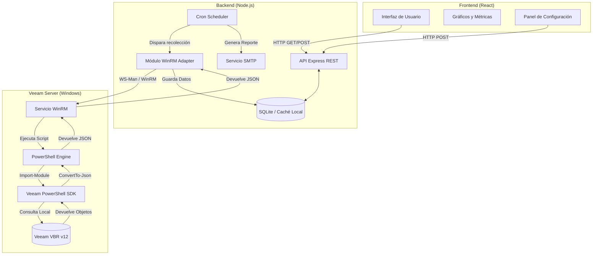

# Rediseño de Arquitectura: Veeam Dashboard con WinRM

El objetivo de este rediseño es reemplazar las llamadas ineficientes a las APIs REST de Veeam ONE y VBR por un mecanismo de recolección de datos altamente optimizado a través de WinRM y el SDK de PowerShell de Veeam, orquestado desde el backend de Node.js.

## Diagrama de Arquitectura Lógica

## Diseño del Módulo WinRM

Se creará un nuevo servicio en el backend (`winrmService.js`) que reemplazará gran parte de la lógica actual de `veeamService.js`.

1. **Librería de Node.js**: Se utilizará una librería como `node-powershell` o un cliente `winrm` nativo para Node.js para establecer la conexión.
2. **Scripting en PowerShell**: El backend enviará un único bloque de script (o ejecutará un `.ps1` remoto) que realizará las siguientes tareas de forma local en el servidor Veeam:
   - Cargar el SDK: `Import-Module Veeam.Backup.PowerShell`
   - Extraer las métricas específicas solicitadas (Jobs, cuotas de repositorios, tasas de éxito).
   - Ensamblar los datos en un `PSCustomObject`.
   - Transformar el resultado a JSON mediante `ConvertTo-Json -Depth 5`.
3. **Parseo en Backend**: Al recibir el output del comando por WinRM, Node.js parseará el JSON devuelto. Esto descarga al Node.js de procesar estructuras complejas, ya que la transformación y filtrado pesado ocurre directamente en el motor de PowerShell del servidor Veeam.

## Optimización del Backend

Para garantizar que el frontend (React) no sufra la latencia de las consultas a Veeam, se optimizará el esquema actual de caché:

1. **Recolección Asíncrona Desacoplada**: El `Scheduler` (cron) ejecutará el `winrmService.js` en intervalos definidos (ej. cada 5-15 minutos).
2. **Ejecución Consolidada**: En lugar de hacer 5-8 llamadas HTTP separadas como se hace actualmente en `cacheService.js`, se enviará **un solo script de PowerShell** a través de WinRM que recolecte repositorios, proxies y jobs en una sola pasada.
3. **Persistencia en SQLite**: El JSON devuelto se mapeará y se insertará en la base de datos `veeam_history.db` usando operaciones `INSERT OR REPLACE`.
4. **Respuestas Inmediatas**: Cuando el frontend consulte `/api/summary`, el backend simplemente hará un `SELECT` a las tablas locales de SQLite, respondiendo en milisegundos, independientemente del estado o carga del servidor de Veeam en ese instante.
5. **Limpieza de Datos**: Se agregará una rutina en el cron para limpiar registros de `job_history` que superen un periodo determinado (ej. 30 días) para evitar que SQLite se degrade.

## Estrategia de Seguridad

Dado que WinRM permite ejecución de código remoto, la seguridad debe ser estricta:

> [!WARNING]
> La configuración de WinRM por defecto en Windows usa HTTP y puede ser vulnerable a ataques de intermediario (MitM) si no se asegura correctamente.

1. **WinRM sobre HTTPS (Puerto 5986)**: Se debe configurar el listener de WinRM en el servidor de Veeam para que utilice un certificado digital (puede ser autofirmado) y obligar a Node.js a conectarse por HTTPS (WinRM port 5986 en lugar de 5985).
2. **Autenticación Fuerte**: Utilizar autenticación NTLMv2 o Kerberos si el backend y Veeam están en el mismo dominio. Evitar Basic Auth sobre HTTP.
3. **Principio de Mínimo Privilegio (Service Account)**: Crear un usuario específico en Windows (ej. `svc_veeam_dash`) y asignarle únicamente el rol de "Veeam Backup Viewer". **No utilizar** la cuenta de Administrador del dominio.
4. **Restricción de Firewall (IP Whitelisting)**: Configurar el Firewall de Windows en el servidor de Veeam para que el puerto 5986 solo acepte conexiones entrantes desde la dirección IP exacta donde reside el Backend Node.js.
5. **Protección del `.env`**: Los archivos `.env` en Node.js que contengan las credenciales de la Service Account deben tener permisos de solo lectura (`chmod 400` en Linux o permisos equivalentes en Windows) limitados al usuario que ejecuta el proceso de Node.js.

## Preguntas Abiertas

> [!NOTE]
> Por favor revisa el plan y confirma lo siguiente:
> 1. ¿El backend (Node.js) se ejecuta en un servidor Linux o en una máquina Windows? Esto influye en la librería de WinRM a elegir.
> 2. ¿Podremos configurar WinRM sobre HTTPS (puerto 5986) en el servidor de Veeam, o estamos limitados a HTTP (puerto 5985) en una red interna segura?
> 3. ¿Deseas que proceda con la modificación del código en `veeam-api-server` para implementar este módulo WinRM como reemplazo de las peticiones REST actuales?
