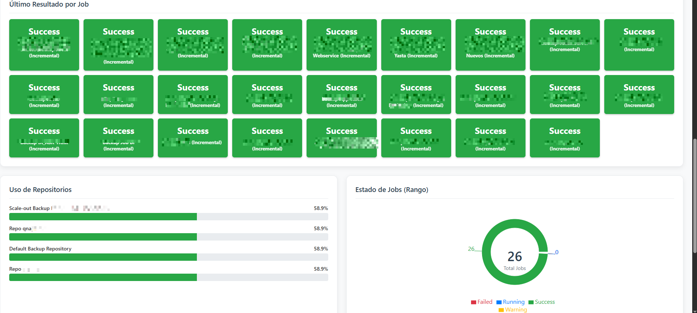
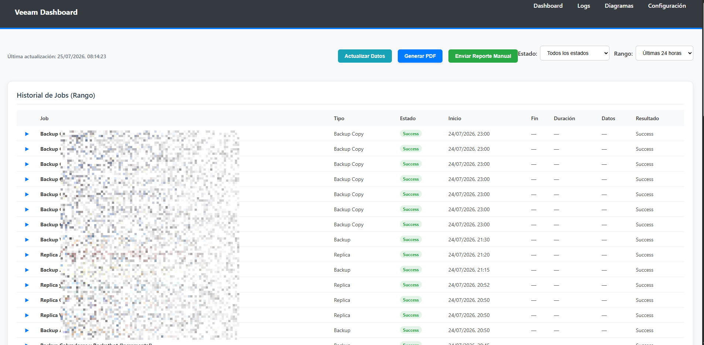
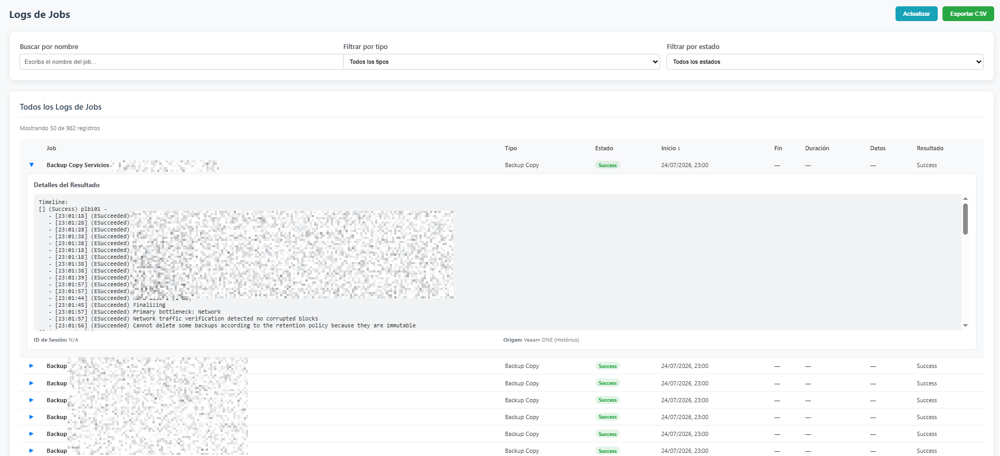
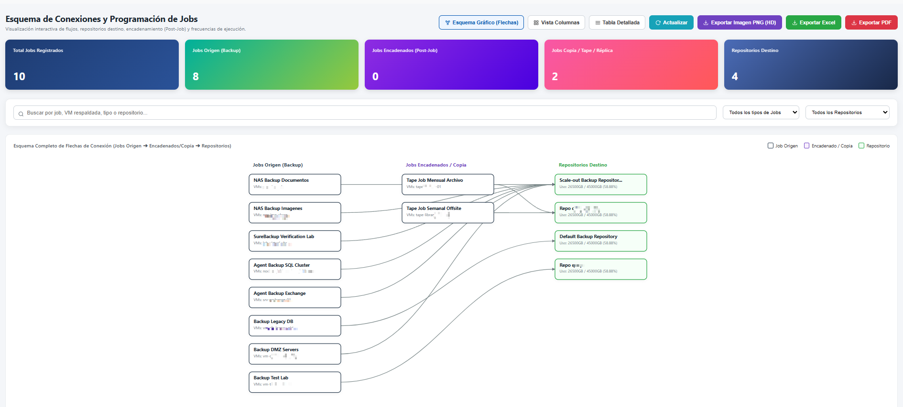

# 📖 Manual de Usuario - Veeam Dashboard

**Autor**: jh4n3r  
**Contacto**: [jh4n3r@outlook.com](mailto:jh4n3r@outlook.com)  
**Proyecto**: Veeam Dashboard (Edición WinRM)  
**Versión**: 1.0.0  

---

## 📌 Índice de Contenidos

1. [Introducción y Navegación](#1-introducción-y-navegación)
2. [Sección 1: Dashboard Principal (`/`)](#2-sección-1-dashboard-principal-)
   - [2.1 Indicadores KPI en Tiempo Real](#21-indicadores-kpi-en-tiempo-real)
   - [2.2 Barra de Filtros y Búsqueda](#22-barra-de-filtros-y-búsqueda)
   - [2.3 Tabla Interactiva de Trabajos](#23-tabla-interactiva-de-trabajos)
   - [2.4 Modal de Detalle de Trabajo](#24-modal-de-detalle-de-trabajo)
   - [2.5 Exportación de Reportes y Auto-refresco](#25-exportación-de-reportes-y-auto-refresco)
3. [Sección 2: Visor de Logs (`/logs`)](#3-sección-2-visor-de-logs-logs)
   - [3.1 Filtros de Registros por Severidad y Fecha](#31-filtros-de-registros-por-severidad-y-fecha)
   - [3.2 Inspector de Mensajes y Salida WinRM](#32-inspector-de-mensajes-y-salida-winrm)
4. [Sección 3: Diagramas de Infraestructura (`/diagrams`)](#4-sección-3-diagramas-de-infraestructura-diagrams)
   - [4.1 Topología Gráfica de Backup](#41-topología-gráfica-de-backup)
   - [4.2 Estado y Capacidad de Repositorios](#42-estado-y-capacidad-de-repositorios)
5. [Sección 4: Centro de Configuración (`/config`)](#5-sección-4-centro-de-configuración-config)
   - [5.1 Parámetros de Conexión WinRM](#51-parámetros-de-conexión-winrm)
   - [5.2 Configuración Notificaciones SMTP](#52-configuración-notificaciones-smtp)
   - [5.3 Herramientas de Diagnóstico y Sincronización Manual](#53-herramientas-de-diagnóstico-y-sincronización-manual)
6. [Resolución de Problemas Frecuentes](#6-resolución-de-problemas-frecuentes)

---

## 1. Introducción y Navegación

El **Veeam Dashboard** está diseñado con una interfaz moderna y responsiva. La barra de navegación superior es fija y permite alternar rápidamente entre las 4 secciones principales:

- 📊 **Dashboard**: Estado general de los backups, métricas y sesiones.
- 📜 **Logs**: Registro histórico de eventos y trazas de ejecución.
- 🗺️ **Diagramas**: Mapas visuales de la topología de respaldo y almacenamiento.
- ⚙️ **Configuración**: Panel de administración de credenciales y pruebas.

---

## 2. Sección 1: Dashboard Principal (`/`)

Esta es la pantalla de control central para el operador de infraestructura.

### 2.1 Indicadores KPI en Tiempo Real
En la parte superior encontrarás tarjetas con métricas consolidadas:
- **Total de Trabajos**: Número total de respaldos configurados.
- **Éxitos (Success)**: Trabajos completados sin errores (en verde).
- **Advertencias (Warning)**: Trabajos completados pero con observaciones (en amarillo).
- **Fallidos (Failed)**: Trabajos con error crítico (en rojo).
- **En Ejecución (Running)**: Trabajos activos en este momento (en azul animado).
- **Total Datos Procesados**: Volumen total en GB/TB leídos del almacenamiento.
- **Velocidad Promedio**: Velocidad de procesamiento en MB/s.

### 2.2 Barra de Filtros y Búsqueda
Permite acotar los datos mostrados en tiempo real:
- **Caja de Búsqueda**: Filtra por nombre de trabajo o nombre de máquina virtual.
- **Filtro de Estado**: Permite mostrar solo `Todos`, `Success`, `Warning`, `Failed` o `Running`.
- **Filtro por Tipo de Trabajo**: Separa entre `Backup`, `Backup Copy`, `Replication`, `SureBackup` o `Tape`.
- **Rango de Fechas**: Selecciona una fecha inicial y final para auditoría.

### 2.3 Tabla Interactiva de Trabajos
Muestra el detalle estructurado de cada tarea:
- **Nombre del Trabajo**: Nombre asignado en Veeam B&R.
- **Tipo**: Icono identificador según la tecnología.
- **Estado**: Badge de color con el resultado final.
- **Última Ejecución**: Hora y fecha del último punto de restauración.
- **Duración**: Tiempo consumido por la tarea.
- **Tamaño Transferido**: Cantidad real transmitida por la red.
- **Acciones**: Botón `Ver Detalle` para desplegar el modal.

### 2.4 Modal de Detalle de Trabajo
Al hacer clic en un trabajo, se despliega una ventana modal con:
- Lista de Objetos/VMs respaldadas en la sesión.
- Puntos de restauración creados.
- Traza del mensaje de error exacto retornado por PowerShell/WinRM si la tarea falló.
- Tasas de compresión y deduplicación.

### 2.5 Exportación de Reportes y Auto-refresco
- **Botón `Exportar a CSV`**: Genera un archivo `.csv` descargable con el resumen filtrado actual.
- **Selector de Auto-refresco**: Habilita la actualización periódica cada **30 segundos**, **1 minuto** o **5 minutos**.

---

## 3. Sección 2: Visor de Logs (`/logs`)

Esta sección permite auditar detalladamente los eventos generados durante las ejecuciones.

### 3.1 Filtros de Registros por Severidad y Fecha
- **Selector de Nivel**: `Información`, `Advertencia` o `Error`.
- **Búsqueda por palabra clave**: Busca términos específicos como `"VSS"`, `"Timeout"`, `"Snapshot"`, etc.
- **Filtro por Nombre de Sesión**: Aísla los registros de un trabajo en particular.

### 3.2 Inspector de Mensajes y Salida WinRM
- Haz clic en cualquier fila de log para expandir el cuadro de detalle.
- Muestra el texto original emitido por los cmdlets de Veeam PowerShell (`Get-VBRBackupSession`), facilitando el diagnóstico técnico avanzado.

---

## 4. Sección 3: Diagramas de Infraestructura (`/diagrams`)

Ofrece una visión ejecutiva y técnica del entorno de disponibilidad.

### 4.1 Topología Gráfica de Backup
- Muestra la cadena de conexión entre componentes:
  $$\text{Servidor Veeam B\&R} \longrightarrow \text{Proxies de Respaldo} \longrightarrow \text{Repositorios} \longrightarrow \text{Almacenamiento Secundario}$$
- Identifica cuellos de botella y componentes involucrados en cada flujo.

### 4.2 Estado y Capacidad de Repositorios
- Gráficos de barras que indican el espacio libre vs. utilizado en cada repositorio configurado (Local, NAS, SOBR, S3/Object Storage).
- Indicadores visuales en rojo cuando el espacio disponible es menor al 10%.

---

## 5. Sección 4: Centro de Configuración (`/config`)

Permite administrar la comunicación con la infraestructura Veeam sin necesidad de modificar código.

### 5.1 Parámetros de Conexión WinRM
- **IP / Hostname de Veeam**: Dirección IP o nombre de host del servidor Veeam B&R (ej. `192.168.1.100`).
- **Puerto WinRM**: `5986` (HTTPS recomendada) o `5985` (HTTP).
- **Usuario de Dominio**: Formato `DOMINIO\usuario` con permisos de administrador en Veeam.
- **Contraseña**: Clave de acceso WinRM.

### 5.2 Configuración Notificaciones SMTP
- **Servidor SMTP**: Dirección del servidor de correo.
- **Puerto y Cifrado**: Puerto (587 / 465 / 25) y protocolo SSL/TLS.
- **Destinatarios**: Correos a los cuales enviar el reporte diario de alertas.

### 5.3 Herramientas de Diagnóstico y Sincronización Manual
- **Botón `Probar Conexión WinRM`**: Ejecuta una verificación instantánea hacia el servidor Veeam y muestra si el puerto 5986 responde correctamente.
- **Botón `Sincronizar Datos Ahora`**: Fuerza al backend Node.js a ejecutar el barrido PowerShell inmediatamente y actualizar la base de datos SQLite.

---

## 6. Resolución de Problemas Frecuentes

| Problema | Causa Probable | Solución |
| :--- | :--- | :--- |
| **Error: "WinRM Connection Failed"** | El servicio WinRM no está configurado o el puerto 5986 está bloqueado en el Firewall. | Ejecuta `Setup-WinRM.ps1` en el servidor Veeam como Administrador y verifica la variable `$AllowedIPs`. |
| **No se muestran datos en las tablas** | La base de datos local SQLite está vacía o recién inicializada. | Ve a **Configuración** y haz clic en `Sincronizar Datos Ahora` o espera al siguiente ciclo de refresco. |
| **Certificado SSL invadido / rechazado** | WinRM utiliza un certificado autofirmado por defecto. | Asegúrate de que el backend tenga configurada la opción de ignorar validación de CA en entorno de prueba (`rejectUnauthorized: false`). |

---

## 🧑‍💻 Soporte y Firma

Para dudas, soporte o contribuciones al proyecto:

- **Desarrollador**: jh4n3r
- **Correo Electrónico**: [jh4n3r@outlook.com](mailto:jh4n3r@outlook.com)
- **Repositorio**: [GitHub - jh4n3r/veeam-dash](https://github.com/jh4n3r/veeam-dash)
